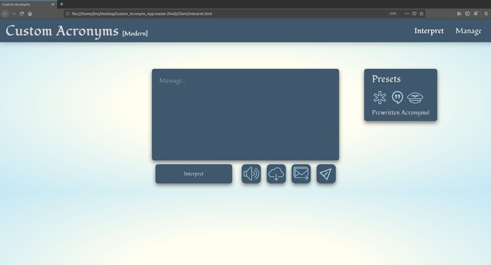
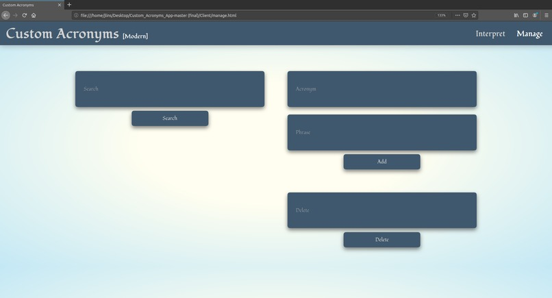

# Custom_Acronyms

# Inspiration
To make messaging easier for the average person, and for professions that include a substantial amount of acronyms such as Doctors and Pilots to communicate with co-workers faster especially when time is crucial.

# What it does
It allows anyone to create their own custom acronyms so they can save time while messaging others. You can add, search, delete, and overwrite acronyms. Our application has common acronyms out of the box such as "ikr" or "btw", but users can also add additional presets. Currently, there are three presets that can be imported: everyday, medical, and piloting. We also created some fancy features such as text to speech, download, email, and SMS.

# How we built it
With Golang as the server-side language and HTML/CSS/JS on the frontend. This was done by creating an API on the server.

# Challenges we ran into
Some git issues and plenty of bugs.

# Accomplishments that we're proud of
Teamwork, speed, our product is easy to use!

# What we learned
Daniel and I learned each other's workflow which boosted efficiency.

# What's next for Custom Acronyms Retro
We hope to deploy it just for fun on a basic home server.

# run
`cd /CustomAcronymsApp`
`sh run.sh`
